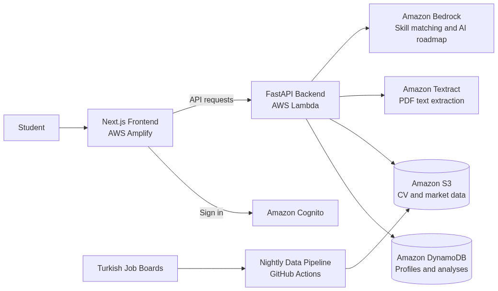

# Calibrate

A job-skill gap analyzer for computer science students in Turkey. Upload a CV,
pick the roles you are aiming for, and find out which skills those roles ask for
that your CV does not have, measured against job postings that are open right
now rather than a generic checklist.

Live at **[usecalibrate.dev](https://usecalibrate.dev)**.

## Features

- **CV parsing in two languages.** PDF or DOCX, read by Amazon Textract, with
  skills matched through a 92-entry bilingual vocabulary, ESCO and Cohere
  embeddings.
- **Editable extraction.** You review and correct the skills it found.
- **Gap analysis against 11 role clusters.** Pick several at once. Each missing
  skill carries its market frequency and trend.
- **Market trends.** Demand per skill over 28-day windows.
- **AI learning roadmap.** A Strands agent on Claude Sonnet 4.6 turns the gap
  list into ordered steps and project ideas, with progress tracking and PDF
  export.
- **Job board.** Collected postings filtered by role, skill and city, with
  links checked nightly.
- **Accounts.** Cognito sign-up with email verification, Google sign-in, Turkish
  and English, light and dark themes.

## Tech Stack

| Layer | What we use |
|---|---|
| Frontend | Next.js 16 (App Router, static export), React 19, TypeScript, Tailwind CSS v4, Bun |
| Backend | FastAPI on AWS Lambda via Mangum, Python 3.13 |
| Auth | Amazon Cognito, Google sign-in, verification mail through SES |
| Data | DynamoDB for user data, S3 for pipeline artifacts and CV uploads |
| AI | Amazon Textract, Cohere `embed-multilingual-v3` and Claude Sonnet 4.6 on Bedrock, Strands Agents |
| Skills | ESCO multilingual ontology plus a hand-built bilingual keyword vocabulary |
| Infra | AWS SAM, AWS Amplify, Cloudflare DNS, GitHub Actions |

## Architecture



## Setting Up Locally

**Prerequisites:** Python 3.13, [Bun](https://bun.sh), and AWS credentials with
access to Textract, Bedrock, Cognito, DynamoDB and S3.

**Backend:**

```bash
cd backend
python3.13 -m venv .venv && source .venv/bin/activate
pip install -r app/requirements.txt -r requirements-dev.txt
cd app && fastapi dev main.py
```

Runs on http://127.0.0.1:8000, with API docs at `/docs`.

**Frontend**, in a second terminal:

```bash
cd frontend
bun install
bun dev
```

Runs on http://localhost:3000, and needs the backend running.

**Environment variables.** Create `backend/.env`:

```
AWS_ACCESS_KEY_ID=
AWS_SECRET_ACCESS_KEY=
AWS_REGION=eu-central-1
AWS_DEFAULT_REGION=eu-central-1
```

And `frontend/.env.local`:

```
NEXT_PUBLIC_API_URL="http://127.0.0.1:8000"
NEXT_PUBLIC_COGNITO_DOMAIN="https://calibrate-auth.auth.eu-central-1.amazoncognito.com"
NEXT_PUBLIC_APP_CLIENT_ID="ar9ujl2ru4lvcoe4g5gblq507"
```

## Project Structure

```
calibrate/
├── backend/            FastAPI app, the data pipeline, the scrapers
│                       → backend/README.md for module-level detail
├── frontend/           the web app
│                       → frontend/README.md for routes and components
└── .github/workflows/
    ├── scrape.yml            the nightly pipeline
    └── backend-tests.yml     pytest and ruff on every PR touching backend/
```

## Testing

```bash
cd backend && pytest
```

Data integrity checks rather than unit tests: every demand-profile skill has a
vocabulary entry and a learning resource, every shown posting has a working link,
and nothing past its closing date reaches the board.

## Deployment

Backend, from `backend/` with Docker running:

```bash
sam build --use-container
sam deploy
```

The frontend deploys itself: Amplify builds from `main` on push.

## Team

İnan Derin Akın, Eren Kozan, Kutay Görür, Çınar Sakin and Cerine Bessaa, over
the summer of 2026.
