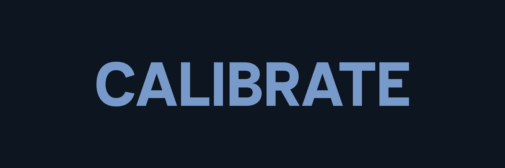
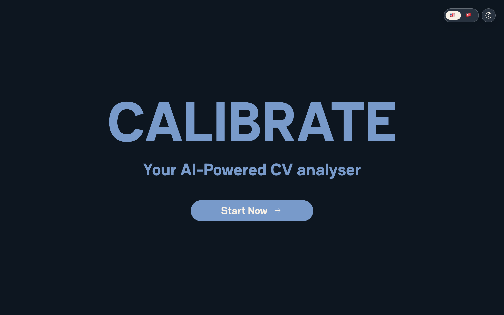
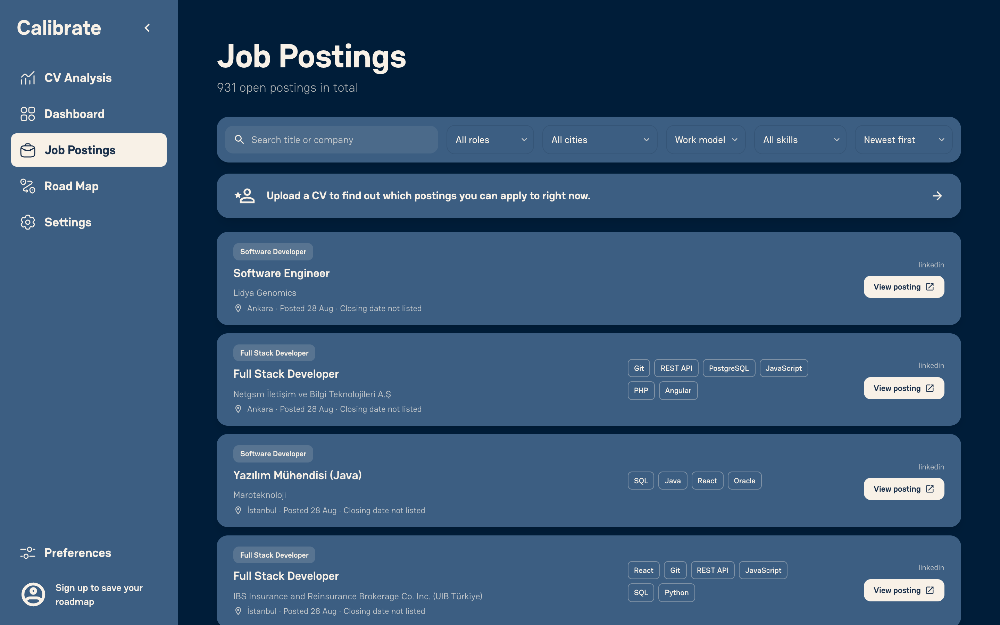
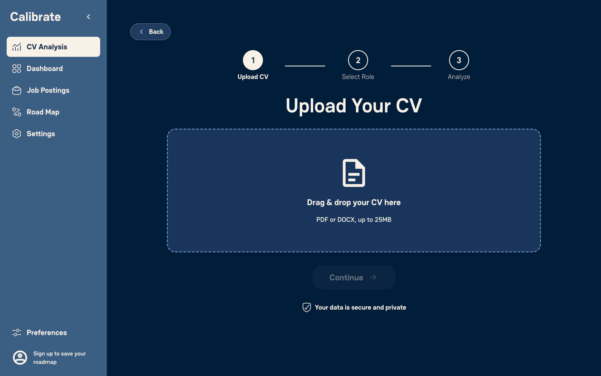

# Calibrate



A job-skill gap analyzer for computer science students in Turkey. Upload a CV,
pick the roles you are aiming for, and find out which skills those roles ask for
that your CV does not have, measured against job postings that are open right
now rather than a generic checklist.

Live at **[usecalibrate.dev](https://usecalibrate.dev)**.

## Features

- **CV parsing in two languages.** PDF or DOCX, read by Amazon Textract, with
  skills matched through a 92-entry bilingual vocabulary, ESCO and Cohere
  embeddings.
- **Editable extraction.** You review and correct the skills it found.
- **Gap analysis against 11 role clusters.** Pick several at once. Each missing
  skill carries its market frequency and trend.
- **Market trends.** Demand per skill over 28-day windows.
- **AI learning roadmap.** A Strands agent on Claude Sonnet 4.6 turns the gap
  list into ordered steps and project ideas, with progress tracking and PDF
  export.
- **Job board.** Collected postings filtered by role, skill and city, with
  links checked nightly.
- **Accounts.** Cognito sign-up with email verification, Google sign-in, Turkish
  and English, light and dark themes.

## Screenshots



**Job board.** Every posting the pipeline collected, filtered by role, skill and
city.



**CV upload.** Step one of the analysis flow.



## Tech Stack

| Layer | What we use |
|---|---|
| Frontend | Next.js 16 (App Router, static export), React 19, TypeScript, Tailwind CSS v4, Bun |
| Backend | FastAPI on AWS Lambda via Mangum, Python 3.13 |
| Auth | Amazon Cognito, Google sign-in, verification mail through SES |
| Data | DynamoDB for user data, S3 for pipeline artifacts and CV uploads |
| AI | Amazon Textract, Cohere `embed-multilingual-v3` and Claude Sonnet 4.6 on Bedrock, Strands Agents |
| Skills | ESCO multilingual ontology plus a hand-built bilingual keyword vocabulary |
| Infra | AWS SAM, AWS Amplify, Cloudflare DNS, GitHub Actions |

## Architecture


## Setting Up Locally

Calibrate runs on your own AWS account. `sam deploy` builds almost all of it for
you: the Cognito user pool, its hosted domain and app client, the Google identity
provider, the DynamoDB table and the Lambda. You do not create any of those by
hand in the console.

**Prerequisites**

- Python 3.13 and [Bun](https://bun.sh)
- The [AWS CLI][d8] and the [AWS SAM CLI][d9], used in steps 3 and 4
- An AWS account, and credentials for an IAM user with access to CloudFormation,
  Lambda, Cognito, DynamoDB, S3, Textract, Bedrock and SES
- Docker running, for `sam build --use-container`
- A Google OAuth client id and secret, if you want Google sign-in
  ([Google Cloud Console](https://console.cloud.google.com/apis/credentials))
- An [SES-verified identity][d6] to send verification mail from. `template.yaml`
  currently hardcodes `usecalibrate.dev`, so change that ARN to your own domain
  before deploying.

**1. Install the dependencies**

```bash
cd backend
python3.13 -m venv .venv && source .venv/bin/activate
pip install -r app/requirements.txt -r requirements-dev.txt
```

**2. Put your AWS credentials in `backend/.env`**

Copy `backend/.env.example` to `backend/.env` and fill in the top four only. Get
the key and secret from IAM ([creating access keys][d7]):

```
AWS_ACCESS_KEY_ID=
AWS_SECRET_ACCESS_KEY=
AWS_REGION=eu-central-1
AWS_DEFAULT_REGION=eu-central-1
```

**3. Deploy your own stack**

This is the step that creates the Cognito pool, the table and everything else.

```bash
cd backend
sam build --use-container
sam deploy --guided
```


**4. Fill in the rest of `backend/.env` from that output**

`sam deploy` prints `UserPoolId`, `AppClientId` and `HostedUiDomain` when it
finishes. To read them again later:

```bash
aws cloudformation describe-stacks --stack-name calibrate-sam \
  --query "Stacks[0].Outputs[?OutputKey=='UserPoolId'||OutputKey=='AppClientId'||OutputKey=='HostedUiDomain']"
aws cloudformation describe-stack-resources --stack-name calibrate-sam \
  --query "StackResources[?ResourceType=='AWS::DynamoDB::Table'].PhysicalResourceId"
```

| `.env` key | where it comes from |
|---|---|
| `USER_POOL` | `UserPoolId` output |
| `APP_CLIENT` | `AppClientId` output |
| `USER_TABLE` | the DynamoDB table's physical id, second command |
| `CONTACT_EMAIL` | whichever inbox you want contact-page mail delivered to |


**5. Point the frontend at it**

Copy `frontend/.env.example` to `frontend/.env.local`. `NEXT_PUBLIC_COGNITO_DOMAIN`
is the `HostedUiDomain` output and `NEXT_PUBLIC_APP_CLIENT_ID` is `AppClientId`,
the same value as step 4.

```
NEXT_PUBLIC_API_URL="http://127.0.0.1:8000"
NEXT_PUBLIC_COGNITO_DOMAIN=""
NEXT_PUBLIC_APP_CLIENT_ID=""
```


**6. Run both halves**

```bash
cd backend/app && fastapi dev main.py     # http://127.0.0.1:8000, docs at /docs
cd frontend && bun install && bun dev     # http://localhost:3000, second terminal
```

Reference: [`sam deploy`][d1], [`describe-stacks`][d2],
[`describe-stack-resources`][d3], [stack outputs][d4], [Cognito user pools][d5].

[d1]: https://docs.aws.amazon.com/serverless-application-model/latest/developerguide/sam-cli-command-reference-sam-deploy.html
[d2]: https://docs.aws.amazon.com/cli/latest/reference/cloudformation/describe-stacks.html
[d3]: https://docs.aws.amazon.com/cli/latest/reference/cloudformation/describe-stack-resources.html
[d4]: https://docs.aws.amazon.com/AWSCloudFormation/latest/UserGuide/outputs-section-structure.html
[d5]: https://docs.aws.amazon.com/cognito/latest/developerguide/cognito-user-identity-pools.html
[d6]: https://docs.aws.amazon.com/ses/latest/dg/creating-identities.html
[d7]: https://docs.aws.amazon.com/IAM/latest/UserGuide/id_credentials_access-keys.html
[d8]: https://docs.aws.amazon.com/cli/latest/userguide/getting-started-install.html
[d9]: https://docs.aws.amazon.com/serverless-application-model/latest/developerguide/install-sam-cli.html

Tests and deployment detail are in [backend/README.md](backend/README.md) and
[frontend/README.md](frontend/README.md).

## Project Structure

```
calibrate/
├── backend/            FastAPI app, the data pipeline, the scrapers
│                       → backend/README.md for module-level detail
├── frontend/           the web app
│                       → frontend/README.md for routes and components
└── .github/workflows/
    ├── scrape.yml            the nightly pipeline
    └── backend-tests.yml     pytest and ruff on every PR touching backend/
```

## Team

İnan Derin Akın, Eren Kozan, Kutay Görür, Çınar Sakin and Cerine Bessaa, over
the summer of 2026.
